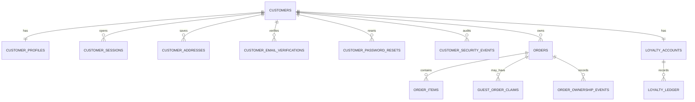

# HICO Customer Data Model

## Status

This is the frozen target model for PR15.1 onward. PR15.0 creates no tables and
does not migrate data. Customer and Admin are separate identity domains. Shared
password hashing, session signing, CSRF, audit, and database utilities are
implementation primitives, not permission bridges.

## Identity model

| Table | Required fields and constraints | Source of truth |
| --- | --- | --- |
| `customers` | UUID primary key, unique `email_normalized`, `email_verified_at`, credential reference, status, timestamps | Customer identity |
| `customer_profiles` | One-to-one `customer_id`, contact fields, nullable `phone`, consent, timestamps | Customer profile |
| `customer_sessions` | Opaque hashed token, customer FK, expiry, revocation, CSRF/session metadata | Customer sessions |
| `customer_email_verifications` | Hashed one-time token, email snapshot, expiry, consumed timestamp | Email verification |
| `customer_password_resets` | Hashed one-time token, expiry, consumed timestamp, rate-limit context | Password reset |
| `customer_security_events` | Customer FK nullable for pre-account events, type, redacted metadata, timestamp | Security audit |
| `customer_addresses` | Customer FK, immutable address snapshot fields, default flag, timestamps | Saved addresses |

`email_normalized` is the only v1 account identifier: required, unique, and
verified before normal account access. Phone is nullable, not unique, and cannot
be used for login, claim, or recovery. An unverified account can access only
verification flows.

Customer cookies are `hico_customer_session` and a customer CSRF cookie/token.
Admin cookie names, tables, and validity boundaries remain unchanged. Admin login
is `/quan-tri/dang-nhap`; customer login is `/dang-nhap`. Both session types
can coexist in one browser without granting each other access.

## Order and ownership model

PR15.2 makes PostgreSQL canonical; JSON remains only a migration and rollback
adapter.

| Table | Required model | Constraints and indexes |
| --- | --- | --- |
| `orders` | Internal UUID, immutable public `order_id`, nullable `customer_id`, status, guest contact/shipping snapshots, totals/currency, timestamps | Unique `order_id`; indexes on `(customer_id, created_at DESC)` and `(status, created_at DESC)`; FK when present |
| `order_items` | Order FK and immutable canonical product/SKU/name/quantity/price/currency snapshots, fulfillment type, eligibility flags | Index `(order_id, created_at)`; quantity/money constraints |
| `guest_order_claims` | Order FK, hashed signed-email-link token, contact email snapshot, expiry, consumed timestamp, metadata | Unique active token hash; index `(order_id)`; transactional single use |
| `order_ownership_events` | Order FK, previous/new owner nullable, reason, actor category, redacted metadata, timestamp | Append-only; index `(order_id, created_at)` |

The existing statuses remain exactly `PENDING_CALLBACK`, `PENDING_QR_ASSIGN`,
`PENDING_SHIP`, `PROVISIONED`, `SHIPPED`, and `CANCELLED`. Public order
IDs remain unchanged.

Orders store immutable customer, contact, shipping, item, price, and currency
snapshots. Authenticated checkout sets `customer_id` from the customer session
only. Guest checkout keeps contact snapshots and assigns ownership only through
a signed one-time email claim. Provider callbacks may change fulfillment/status
but cannot create, replace, or infer ownership.

## Fulfillment assets and loyalty

Customer list APIs never contain QR/LPA/PIN/PUK. Future asset storage keeps
encrypted/provider-referenced secrets outside list projections and audits every
reveal after owner, CSRF, and recent re-auth checks.

| Table | Purpose | Constraints and indexes |
| --- | --- | --- |
| `loyalty_accounts` | One account per customer; no mutable balance source of truth | Primary key and customer FK |
| `loyalty_ledger` | Append-only `EARN`, `REVERSE`, `ADJUST_ADMIN`, and future event records | Non-zero points/sign constraints; unique business event and idempotency keys; index `(customer_id, effective_at DESC)` |
| `referral_codes` | Customer-owned referral code | Unique normalized code, one active code per customer, no PII-derived value |
| `referral_relationships` | Referrer/referee attribution and review state | Customer FKs, self-referral check, one active relationship per referee, status index |
| `referral_events` | Idempotent apply, qualification, reward, and reversal events | Unique business event key, order FK, rule/version snapshot |
| `referral_rewards` | Link each relationship side to the authoritative ledger entry | Unique relationship/side and ledger-entry FK; no balance column |
| `customer_notifications` | Durable owner-scoped notification inbox | Customer FK, unique `(customer_id, dedupe_key)`, unread and created indexes, safe action path |

The ledger is authoritative and the balance is `SUM(points)`, never edited in
place. `REFERRAL_REWARD` is a positive append-only ledger entry and every
reversal is an append-only `REVERSE` entry. `referral_rewards` stores only the
ledger reference, not a second balance. Referral configuration is read from the
versioned `loyalty_rules.config_jsonb`; application code does not invent a
reward amount.

Referral attribution is created only by an authenticated referee applying an
active code. Same customer, same verified email, and same verified phone are
blocked or sent to `MANUAL_REVIEW`; IP, device, fingerprint, shipping, and
payment matching are not used. Legacy unresolved orders are never backfilled by
email.

Notifications are the database source of truth. Event processors use a stable
`<type>:<customerId>:<entityId>:<eventVersion>` dedupe key. Titles, messages,
metadata, and action paths are allowlisted and never contain QR/LPA/PIN/PUK,
ICCID, tokens, passwords, or full addresses. List and unread projections are
customer-scoped; read mutations require the customer CSRF boundary.

## Retention and deletion boundary

Account export is supported. Delete requests begin a 30-day grace period, then
anonymize profile data while preserving legally required order/audit record
shape. Exact legal retention for orders and audit records is undecided and is a
production blocker for PR15.7.
